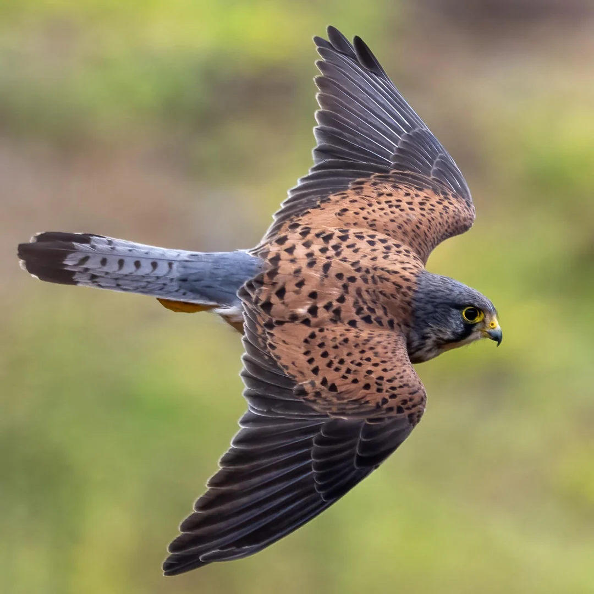

# The hovering hunter

Welcome to Field Notes, a demo publication of the Kestrel application. Everything here, from the subscribers to the sends to this archive, is sample data, so look around and change whatever you like.

The app is named after a small falcon called a [kestrel](https://en.wikipedia.org/wiki/Common_kestrel). One way to spot a kestrel is by how it hunts, using a technique called wind-hovering. The bird faces into the wind and hovers in place, watching the ground below for prey. Here's what a kestrel looks like:

*A male Canarian kestrel in strong wind. Taken in Funchal, Madeira by [u/treecreaper](https://www.reddit.com/r/birdsofprey/comments/1rlew5p/canarian_kestrel/).*

To see what Kestrel can do, open the dashboard and try editing one of the drafts.
