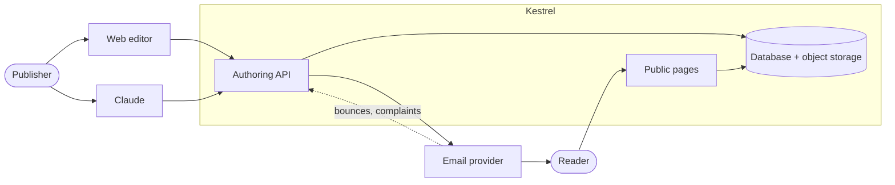

# Kestrel Specification

The high-level, abstract description of Kestrel, the newsletter app. It describes what the system is, what it guarantees, and how it's shaped, not how it's built. The concrete schema lives in `migrations/`, the routes in `src/app.ts`, and the code's structure in `src/`; this document does not restate them.

**Who this is for.** The implementer and the maintainer, human or Claude, and anyone deciding whether Kestrel's guarantees fit their newsletter. It is written for a cold reader: a term defined elsewhere carries a pointer to where.

**Status.** A living document that tracks `main`. The rule for keeping it in step with the code is `.claude/rules/maintainer.md`.

**How to read it.** §1 to §3 are the contract: what the app is, the kind of application it is and the principles that follow from that, the six nouns, and the six invariants. §4 to §12 walk each area of the system. The appendix records what was decided, with the alternative each choice was made over, what the app trusts to the people who run it rather than guarding in code, and what was deliberately deferred. The shape of the API itself, the rules every route follows, is `docs/API.md`.

---

## 1. What this is

An application for writing a newsletter and sending it to subscribers. The publisher writes a post in Markdown, sees exactly what the email will look like, and schedules it for a future date and time, usually days out. Until it fires, the scheduled post stays visible and cancelable; the publisher reviews it in that window, and then it goes out on its own. The app keeps the subscriber list, remembers what it sent, and preserves each post as a permanent page.

Three roles appear in this document. The **publisher** writes posts and sends them. The **developer** deploys and runs the app. The **reader** subscribes and receives the newsletter. One person is often both publisher and developer; the document names the role, not the person.

The foundation that makes all of this work is a single HTTP API. Everything the publisher does reaches Kestrel through it, and it has exactly two clients: a **web editor** the publisher drives by hand, and **Claude**, working the same API on their behalf. Both do the same work through it, so Claude does nothing the publisher couldn't do in the editor, and neither reaches past what the API exposes. One API over one copy of the data keeps the two from ever drifting apart. Two other parties reach the app without touching that authoring surface: readers, through a small set of public pages (subscribe, confirm, unsubscribe, and the archive), and the email provider, which reports delivery outcomes back through signature-verified webhooks.

Content lives in the app's own database, with every version of a post kept as a revision. Images are uploaded to a post and referenced by name; the publisher never touches an upload URL. Every send freezes the rendered email, and that frozen copy *is* both the reader's "view in browser" page and the permanent record of what went out.

### What it isn't

- **Not a general CMS.** It serves the newsletter's own reader surface (a landing page, the archive index, and the per-post pages), and only that. It doesn't author arbitrary pages or replace the publisher's website or blog.
- **Not multi-channel.** Email only. Cross-posting to a website, RSS, or social is out of scope.
- **Not a marketing automation suite.** No drip sequences, funnels, or A/B campaigns. One post, reviewed, sent to the list.

### The kind of application this is

Kestrel is for **one publication run by one person**. The publisher is usually also the developer who deploys it, and both of its clients, the editor and Claude, act for that same person. The list runs from hundreds of readers to tens of thousands, a post goes out a few times a month, and a whole publication's history is hundreds of sends, not millions. It is self-hosted on a small platform budget, and no one is paid to watch it.

Those facts decide where the app spends its care, and every rule in this document follows from one of these principles:

- **Guard what cannot be undone or will not be seen.** Mail that has left, consent, and the record of what went out cannot be taken back, and a mistake in them may go unnoticed until a reader complains. These are the invariants (§3), and code enforces them however the app is driven.
- **Make plain what can be undone.** Most of what the publisher does before a send fires can be reversed: a canceled send can be scheduled again, a moved fire time moved back. When two acts meet, as when the editor and Claude act on the same send moments apart, the app answers each one honestly and shows the result, rather than refusing one to prevent a race. Both acts come from the same person, and the review window (§6) is there for noticing. Where a lost change would be silent and costly, such as one writer's edit overwriting another's prose, the app does refuse, and says why (§4).
- **Trust the developer's deliberate acts, and say how to do them safely.** What the developer changes at deploy time (the provider, the credentials, the origins, the upgrade path) is theirs to time. The app checks that a configuration is valid (§9), but it does not follow the developer's changes across time to second-guess them. Where the timing matters, the setup guide says so. The appendix lists what is trusted this way.
- **Build for this scale.** A mechanism earns its place by a failure that can happen at the scale above, and happen often enough, or badly enough, to matter. A case that needs a rare coincidence, and would harm a handful of readers when it happens, is written down rather than engineered around.
- **One API, and the server decides.** Both clients see the same facts and the same choices because the app works out what a send's state means, what is wrong with it, and what can be done to it, once, and both clients show that answer (§8). The API is kept small enough that either client can learn it from its reference. A concept on it earns its place by changing what a client shows or does. `docs/API.md` holds the rules for its shape.

---

## 2. The model

Six nouns make up the whole domain: the first three are content, the last three are the audience and the record.

**Post** — one piece the publisher writes and sends: a Markdown body plus its metadata, editable while a draft, frozen once scheduled, and closed once sent. Its metadata is a **subject** and a **slug**. The subject is the email's subject line, and it also names the post in the list and seeds the slug. The slug is the post's path in the archive. The subject is the one field that must be set to send.

**Revision** — a saved version of a post's Markdown and metadata. Every save writes one. This is the versioning that files would have given for free, handed back deliberately.

**Image** — a file belonging to a post, referenced by name in the Markdown. The app stores it, sizes it, and resolves it to an absolute URL at render time.

**Subscriber** — an email address with a consent state: pending, confirmed, or unsubscribed. Only confirmed subscribers receive sends.

**Send** — one dispatch of a post, created the moment the post is scheduled, not when it fires. It holds the frozen render, the fire time, and after firing, who it reached and how it went. Its frozen render can be made again only while the send is scheduled, and only as the publisher's deliberate act (§6); once it has fired it is never rewritten, while its outcomes keep settling as receipts arrive (§6). The word is both the verb and, like *build* or *deploy*, the noun for one instance of it; the article tells them apart, and *a send* always means this record.

**Suppression** — an address that hard-bounced or complained and must not be mailed again until the publisher clears it deliberately.

### The lifecycle

A post has three states and a send has four, and the two advance on different clocks: the post's state says whether it can be edited, the send's says how far the dispatch has gone.

| Post | Send | What it means |
| --- | --- | --- |
| **draft** | none | Being written. Editable. |
| **scheduled** | **scheduled** | Scheduling makes the email (§6): the render is frozen onto a send and the post is locked. The send is visible and cancelable until it fires: this is the review window (§6). |
| **scheduled** | **sending** | The send has fired and is delivering. The post's state holds, but it is past the window: it can no longer be edited or canceled. |
| **sent** | **sent** | Dispatch is complete. The send is the permanent record of what went out, and the post is closed. |
| **draft** | **canceled** | The publisher canceled the send during its window. The post is unlocked and editable again; the canceled send stays as a record but is no longer active. |

Only one send per post can be active (scheduled or sending) at a time (§6), so the pair above is always unambiguous. Scheduling a draft again after a cancel creates a new send; the old one is history.

---

## 3. Invariants

Six guarantees. In a newsletter the guarantees that matter are about consent, delivery, and the record. Every rule about sending, consent, and the record in this spec upholds one of these.

**I1 — Nothing is sent without recorded consent.** Only confirmed subscribers receive a send. Confirmation is double opt-in and timestamped, so for every delivery there is a record that the person had confirmed, and of when they last did.

**I2 — Unsubscribe is immediate and final.** From the moment an unsubscribe is recorded, no further mail reaches that person: a send already in flight skips them if they have not yet been handed off to the provider, and no later send includes them. There is no window in which they still get one, and it is never silently reversed.

**I3 — What went out is preserved exactly.** Every send freezes its rendered HTML. The reader's "view in browser" page and the permanent record are that same frozen copy, not a re-render, which could differ. Any public chrome an archived post carries (§5) never rewrites the reviewed content.

**I4 — A post is sent at most once per send, to each person at most once.** A repeated trigger never creates a second send (a second send-now finds the existing one; a second schedule is refused, §6), and a retry, a double-click, or a resumed send never mails anyone twice.

**I5 — A test is a real test.** The email the publisher sends themselves to check is produced by the same render path as the email that goes to the list. A clean test is a guarantee, not a lookalike.

**I6 — Nothing is delivered without a window to stop it.** Every send becomes a visible, cancelable send before any mail leaves, for as long as the publisher scheduled and never less than the **minimum lead** (§6). Nothing fires the instant it's requested. This window is the review.

### What follows

- **The schedule is the safety.** Because a send exists as a cancelable send before it fires, a person and Claude can prepare one unattended and still have a window to catch a mistake (I6). This is the newsletter's place where something irreversible is visible before it happens.
- **The archive is the record.** There is no separate "what did the email look like" store to build later (I3). The page a reader opens is the artifact, and it's the very copy that was reviewed.
- **Consent is data the publisher owns, and can prove.** Not a setting on a provider they'd have to trust and can't export (I1).
- **A resend is always safe.** Because a send tracks who it reached, a failed or interrupted send resumes instead of starting over (I4).

---

## 4. Authoring

The publisher writes in Markdown, in the web editor or through the API. Both do the same thing: they read and write posts and their revisions. A post is a **subject** and a body; the **slug** (derived from the subject) rounds out the metadata, and the inbox **preheader** (the snippet a mail client shows beside the subject) is derived from the body at render time. A post is editable only while it's a draft; scheduling locks it (§6).

Subject is deliberately the primary field. For an email that is what the reader sees in their inbox, so it is also what names the post in the editor's list and what seeds the slug: one field carrying the weight rather than a separate "title" that would have to be kept in sync with it.

### Revisions

Every save writes a new revision holding that version's Markdown and metadata. The post points at its current revision; the history is the list behind it. Markdown is small and diffs cleanly, so each revision stores the whole body rather than a delta: simpler, and there's no reconstruction step to get wrong.

This gives a full edit history, the ability to see what changed between two versions, and, because a scheduled post's content is frozen into its send anyway (I3), a clear separation between "the post as it is now" and "the post as it was sent."

### Concurrent edits

One post has two clients that can write it at once (two browser tabs, and Claude editing through the same API), so the authoring API is **optimistically concurrent**, and the rule is *notify, don't clobber.*

Because each save advances the post's current revision, that revision id is its version token. A save may carry the revision it was based on; if that base no longer matches the post's current revision, another writer got there first, and the save is rejected rather than landed, returning the newer revision and who wrote it. A save that omits a base is unchecked (last-write-wins), so a client that doesn't participate still works.

The editor participates on both ends. It sends the base on every save, so a stale save surfaces a notice instead of overwriting, and the writer chooses between taking the other version and keeping their own. It also watches for a newer revision while the post is open, covering another browser and Claude alike, so the writer is warned *before* investing more effort, not only when they save. The notice names who changed it (the revision's author; Claude's saves show as "Claude") and re-arms only when a genuinely newer revision appears.

### Images

Adding an image is uploading it *to a post* and referencing it by name: the publisher uploads the file `cover.jpg` to the post, then writes `` in the Markdown. That's the whole workflow. No endpoint hands back a URL to paste in; the reference is just the filename, the same way it would be written if the image sat in a folder next to the post. At render time the app resolves `cover.jpg` to the stored file's absolute URL and the right size for email. The alt text lives inside the reference, so it's never a separate step and is easy to require.

This is deliberately unlike the systems where text is addressable but an image is a side upload that returns an opaque URL the author has to bridge. Here the author manages one thing, the post, and the image is part of it.

---

## 5. Preview and the reader surface

Preview means two concrete things, and both are the same render aimed differently.

**View in browser** — the post rendered as the email, on a page. For the publisher it is the editor's preview page, behind the admin gate: a live render of the current draft before scheduling, the quick way to check layout, and the frozen copy that will fire once scheduled. For the reader it is the public post page at the archive URL (below), the address every sent email's own "view in browser" link carries; that page exists only once the post has been sent, so the link in a test email resolves only after the send fires.

**Send test** — the real email, rendered and delivered to an address the publisher names, so they can see it in an actual mail client where the rendering finally counts. A test comes in two shapes, both through the one render path (I5): a **post test** sends a specific post to a named address; a **template test**, from the template's settings surface (§9), sends a synthetic sample post so the publisher can proof the *layout* in a real inbox without picking a post. A template test always renders the **saved** template, the one that will ship, never unsaved editor content, so a clean template test is a real guarantee and never a lookalike; the surface saves any pending edits before it sends. Once a post is scheduled, a post test sends its **frozen copy**, exactly as the fire path will, so the test and the view-in-browser page never disagree about what is going out. The default recipients (§9) pre-fill both.

There is exactly **one render path**. It turns a post into the email, and the preview, the test, and the real send all call it. That's what makes I5 hold: if the test looks right, the send is right, because they're the same code producing the same output. Email rendering is client-dependent enough that a faithful web preview isn't sufficient on its own, so the test is the thing the publisher trusts before scheduling, and the view-in-browser page is the convenient first look.

### The public reader surface

Because the app is self-contained (§11), it serves its own reader-facing pages, not only per-post archives, and the publication identity (§9) themes them, so the reader surface reads as *the publication*, not the tool. Three public pages, all indexable and none ever bouncing a visitor toward an admin path (§11):

The **landing page** is the front door at `/`, the one page a reader reaches by typing the bare domain. It carries the identity and a subscribe call to action, features the latest post, lists recent ones, and links into the full archive.

The **archive index** lists every sent post, newest first, each linking to its post page. It lives at the archive base path (§11), the same prefix the post pages sit under, so the list and the posts it links to share one origin and one configured path. It carries the same identity and subscribe call to action as the landing page.

A **post page** serves that post's frozen render (I3). When the archive lives on the app's own origin rather than inside a surrounding website, the page may add light public chrome (a masthead with the newsletter name and the publish date, a link back to the index, a subscribe prompt, and the publication's display font and background), so a shared post reads as part of a publication and not a raw forwarded email. That chrome fills reserved anchors the render leaves in the frozen copy, the same idea as the per-recipient placeholders (§6, §9), so it appears only in the browser, never in a sent email, and the reviewed content is served unchanged (I3). The per-recipient slots are filled for no one: the unsubscribe link becomes the generic subscribe-management link, and the sent-to address is left empty so no reader's address is ever shown. The archive URL an email carries, its "view in browser" and every shared link, is built from the configured archive origin and base path (§11), so the same render is reachable at a stable, public address forever.

No script runs on a reader page, and none can be framed by another site. A post's body is the author's HTML, written by hand or by Claude from material it read, and it is served from the same origin as the admin surface, so the page itself forbids script rather than trusting the render to have removed it. For the same reason nothing in a post can submit a form or send the reader elsewhere on arrival: a form on that origin would act with the publisher's session. The publisher's preview holds to the same rules.

On a local dev instance only, the landing page and archive index also carry a small, clearly marked shortcut into the editor, a developer convenience that is structurally absent once deployed. It is the one deliberate exception to never linking toward admin, allowed because a local instance has no access wall in front of the editor; §11 states the rule and the carve-out.

---

## 6. Scheduling and sending

Sending is built around a review window, because the window is what makes it safe to prepare a send days ahead, by hand or with Claude, and let it go out unattended. **Scheduling is the main path; sending immediately is the deliberate exception.**

### Scheduling a post

Scheduling **makes the email**. It does three things at once: it **freezes the render** into a new send (the one copy that is the review artifact, what will fire, and the archive, I3), it **soft-locks the post** so it can't drift from what was reviewed, and it **records the fire time**. The frozen copy captures three inputs as they stand at that moment: the post's content, the email template (§9), and the publication identity. The content reaches a scheduled send afterward only by cancel, edit, and schedule again. A change to the template or the identity **re-makes every scheduled send at once**, after the publisher confirms it, so no scheduled send is ever on an older template or identity than the one in use (§9). The fire time must be at least the **minimum lead** out; the freeze rejects anything closer, so every send, however requested, spends at least that long visible and cancelable (I6). The lead is one app-wide interval, set per deployment within bounds: never shorter than the sweep's cadence (below), since under that the sweep rather than the lead would decide when a send fires, and never so long that it stops being a review window and becomes a hold on every send. A lead outside those bounds is refused like any other bad setting (§9). The lead is deploy-time configuration, never a preference, because the API is also Claude's door: a review window Claude could shorten through the API would be no guard against Claude. From then until its fire time the send is **visible and cancelable** (I6): the publisher and Claude review it, test emails go to real inboxes, and if anything is wrong the publisher cancels it. The window closes at the fire time itself, not when the sweep gets to the send: from then it can no longer be canceled or moved, even in the moment before it starts.

A post **must have a non-empty subject** to schedule or send. The subject is what the reader sees in their inbox and a send is irreversible (I4), so the freeze rejects an empty or whitespace-only subject before anything is frozen, the same guard for both clients, whatever the editor shows beforehand. An empty body is warned about, not blocked.

### The soft-lock

A scheduled post is locked: the API refuses every write to it (body, metadata, images) until its send is canceled, so the lock is enforced, not merely shown. It is *soft* only in that a cancel undoes it. To change it the publisher **cancels** the scheduled send, which unlocks the post, then edits, re-tests, and schedules it again. Editing stays easy but becomes deliberate, and it resets the review.

A **re-make is a freeze**. It renders each scheduled send again from the same locked content, the current template, and the current identity, at the same fire time; it resets the sign-off, so the last approving test should be of the re-made copy; it is refused while any scheduled send is inside the minimum lead, as a move is, because a freeze inside the lead would leave less than the minimum window to review what it produced (I6); and it never touches a send that is sending or sent. The identity is not versioned: renaming the publication is a global act, not a look, and reaches scheduled sends the same way.

The guarantee: *what fires is exactly what was last frozen, and a freeze is always the publisher's deliberate act*: a schedule, a schedule again after a cancel, or a confirmed re-make after a template or identity change (§9). Each re-freezes the render and resets the sign-off, so the last approving test should be of the copy that fires. Since no one is at the keyboard at fire time, that test is the sign-off, and the lock is what stops the post drifting from it. Freezing at schedule time also makes the send immune to app deploys during the window: the render was captured up front, so a change to the renderer in between can't alter what goes out.

A post has **at most one active (scheduled or sending) send** at a time, and this holds even across concurrent requests: a second schedule request is refused rather than slipping through, and a second send-now finds the existing send and returns it. Finished and canceled sends don't count, so scheduling again is unaffected. I4 and I6 rest on this: cancel, the status surface (§8), and the sweep (below) each assume a single, unambiguous active send.

### Moving the fire time

Changing *when* a scheduled send fires is not a content change, so it doesn't go through cancel → edit → schedule again. The fire time is **moved directly** on the scheduled send (the one-call *reschedule*, §8): the same send, still the post's one active send, still visible and cancelable, now aimed at a new time. The frozen render is untouched (I3) and the review window is preserved rather than reset (I6). Two guards: the new time must be at least the minimum lead out, and only a send whose fire time has not yet come can be moved; once the fire time passes it is past the window, whether or not it has begun sending.

### Sending now

Sending immediately is the same machinery with the fire time set to now plus the minimum lead, so even an "immediate" send is a visible, cancelable send for that long (I6). It's for the case the publisher has reviewed out of band and wants it gone; most sends should carry a real window.

### The timer

The driver is a periodic **sweep**: a scheduled task on a fixed, short cadence that finds sends whose fire time has passed and that haven't gone out, and delivers them. A send the sweep finds late is still delivered: the window closed at the fire time, so lateness is a delay, not a new decision. A sweep rather than a per-send alarm for one decisive reason: the same loop that fires due sends also notices a fire time that has slipped past without delivery, and raises it loudly (§12). One reconciling loop is simpler and safer than precise timers plus a watchdog, and it tolerates an occasional slow tick by design.

### What a send does when it fires

Because the body is already frozen, firing is just delivery. The send loop:

1. **Reads the send**, which already holds the frozen email. A second trigger, whether a later sweep tick or a repeated request, finds this record and resumes rather than restarting (I4); only one loop works a send at a time (it holds a lease on the send), so two overlapping ticks can never both hand off the same recipient.
2. **Resolves the audience at that moment**: confirmed subscribers minus suppressed addresses. The audience is not fixed at schedule time, so a reader who confirms after the post was scheduled is included, and the subscriber count shown while a send is scheduled is a snapshot, not a promise.
3. **Delivers in batches**, checking each recipient's consent and suppression again at hand-off (I2), filling in their unsubscribe link and address where the frozen body left placeholders, and marking each one as the provider accepts them. Progress is durable, so an interrupted send resumes from where it stopped and no one is mailed twice (I4). A send larger than one sweep tick can carry spans several: each tick delivers what it can finish and stops cleanly, and the next continues.
4. **Records outcomes as they arrive** (accepted, delivered, bounced, complained) against each recipient.
5. **Marks the send sent** once every recipient is accepted or terminal, or leaves it open and retrying while the provider is unavailable or refuses the account. Neither is held against any recipient, so neither can finish a send by recording its audience unsent (§12).

### Two stages: accepted, then settled

Delivery is two events separated in time. First the send **hands off** each recipient to the provider and records whether it was **accepted**: this is dispatch, and it finishes in seconds to minutes. Only later do the provider's webhooks report what actually happened to each accepted message, **delivered, bounced, or complained**, lagging acceptance by anything from seconds to days. So a send reports two numbers, never conflated: *provider-accepted* and *delivery-confirmed*.

A send is **"sent" when dispatch completes**: every recipient accepted by the provider, or terminal (recorded unsent or skipped); the record then keeps absorbing receipts, so its delivery, bounce, and complaint counts stay live afterward. That is the only honest "done" for a batched transport with lagging webhooks: waiting for every receipt would mean a send never finishes, because some accepted messages are never confirmed at all.

### Recovery

Everything that goes wrong after the fire time is recovery, and §12 holds the posture: retries with backoff, resumption after an interruption, suppression fed by the provider's webhooks, and a loud flag for the few things a person must see. The one rule none of it bends: no automatic behavior ever widens the audience beyond confirmed-minus-suppressed, or skips the window.

---

## 7. Subscribers and consent

A subscriber is an email address with a **consent state**, plus an orthogonal **suppression** flag for deliverability. The consent state is the whole story of whether someone has asked to be on the list; suppression is a separate "this address can't or shouldn't be delivered to" mark.

| State | Meaning | In the send's audience? |
| --- | --- | --- |
| **Pending** | Subscribed but hasn't clicked the confirmation link yet | No |
| **Confirmed** | Completed double opt-in; consent is recorded and timestamped | Yes, unless suppressed |
| **Unsubscribed** | Left the list (their own unsubscribe, or the publisher on their behalf) | No |

**Suppressed** is not a consent state but a flag that can sit on top of one: an address that bounced hard or drew a complaint is excluded from every send whatever its consent state, so a subscriber can be *confirmed and suppressed* at once, consented but never mailed. The audience for any send is exactly *confirmed minus suppressed*. The two marks have different owners, which is what keeps them distinct: unsubscribed is the reader's to set (or the publisher's, on their behalf) and the reader's to clear by subscribing again; suppressed is set by the app from the provider's signals and cleared only by the publisher, deliberately. Suppression is a deliverability rule (§10), separate from the consent rule (I1).

### Joining

Someone subscribes through a public form, which creates a **pending** subscriber and sends a confirmation email. The link in it opens a page with a Confirm button, and pressing it **confirms** them (double opt-in). Only confirmed subscribers are ever mailed (I1). Double opt-in is a deliberate cost: it's the record that consent was given, it keeps the list clean, and it protects sending reputation.

Consent is recorded only by a deliberate action of the address's owner. Opening the link records nothing, because mail scanners open every link in a message before a person sees it, and a fetch by a scanner is not the owner agreeing to anything. A confirmation link is also valid for a limited time, a fixed number of days after it was sent; an older link records nothing and offers to send a fresh one instead, so a long-forgotten email can't put someone on the list.

The form is public, so it must not become a way to learn who subscribes or to flood a stranger's inbox. **A subscribe request never reveals list membership:** it gets the same answer, just as quickly, whether the address is new, pending, confirmed, unsubscribed, or suppressed, because the answer comes before any confirmation is sent. **Confirmations are rate-limited per address:** one goes out only when it is due, never to an address already confirmed, never to a suppressed one, and at most once per address in a fixed interval of minutes, however often the address is submitted; a repeat inside that interval sends nothing. How often any one client may submit the form is a limit set at the edge when the app is deployed, not in the app.

A confirmation that was due can still fail to go, when the email provider refuses it. The requester has already been told to check their inbox, and telling them otherwise would give away that the address was not on the list, so nothing about the address changes instead: a new address is not left pending, an existing one keeps the last link that did arrive, and no interval starts, so a reader whose email never comes can simply submit again. When the provider gives no answer at all, the email may have arrived, so its link is kept and the per-address interval still applies. A publisher adding someone by hand is told of a refusal as it happens, and, since the admin surface is theirs, why no confirmation went out when none was due.

The confirmation email's **wording** (its subject, the line above the button, the button's label, and an optional reassurance footer) is the publisher's to edit, a runtime preference (§9). Its structure is not: it always opens with the publication identity as a masthead, because a first-touch email says who it is before the ask, and the masthead degrades to nothing when no identity is set. The confirm link is inserted by the app and always present, a required field left blank falls back to a built-in default, and the HTML and plain-text bodies are generated together, so no edit can produce a confirmation email that is wordless, misshapen, or missing the link that records consent (I1). It is transactional, not a post: it does not use the post template and carries no unsubscribe link.

### Leaving

Every email carries an unsubscribe link and the one-click header that bulk mail now requires, so a subscriber can leave from the message itself with no login and no confirmation step. Unsubscribing is immediate and final (I2). The publisher can also unsubscribe someone from the subscriber list, the same immediate, idempotent effect, for a request that arrives out of band; it never auto-confirms anyone, only removes consent.

### Two tokens, two jobs

A subscriber carries two independent unguessable tokens, one per job, and neither can do the other's. The **confirm token** drives double opt-in and is one-shot: it is replaced each time a new confirmation is sent, so only the newest link confirms and a stale one can't be replayed, and it is valid only for a limited time (Joining, above). The **unsubscribe token** is durable and never rotated, not even across an unsubscribe and a resubscribe, because it is embedded in the one-click link of every post already delivered: a returning subscriber can still leave from mail that has sat in their inbox since before they last left (I2). One token doing both jobs would go dead in delivered mail the moment it rotated.

### Deferred: topics and segmentation

Topics and segmentation, letting people subscribe to some kinds of post and not others, are a real feature and a deliberate v2. They add a preference center and turn "the audience" into "the audience matching this post's topics." The model is built so this slots in as a filter applied when a send resolves its audience, plus a few fields on the subscriber, without disturbing anything above.

---

## 8. Seeing what's happening

A small status surface, readable in the editor and through the API, answers the questions the publisher will actually have. Each answer is made of the record itself, never a separate summary that could drift from it.

A send reads the same wherever it appears. Its phase (§12), anything wrong with it, and what can be done to it right now are worked out once, by the app, from the record, and every place that lists or shows the send reports that one answer, in the app's own words, so the list of sends and a send's own watch never disagree about it, and the editor and Claude see the same problems and the same controls. A control is offered only while the app would accept it. Every answer about a send, whether the list, the send itself, what changed, or the result of an act, describes it the same way and says where it stands in the order of changes, so a client holding two answers about one send knows which is newer, and can keep one copy current from any of them. And every change made to a send, whether the editor, Claude, or the app itself made it, takes its place in one order across all sends, removing a send included. A client can therefore tell whether anything changed since it last looked, including a change the other client made to a send it was not watching, rather than trusting a snapshot that only the changes it expected would update. What the clock changes rather than a write, such as a fire time passing or a send staying in flight too long, is not in that order, but a client asking what changed since it last looked is told of it all the same.

### What's scheduled, and when does it fire?

The pending sends, each with its fire time and its frozen render. Because acting on the review window is what makes it real (a window no one can see into or act on isn't one, I6), each carries the actions that manage a pending send without editing its content: a **one-call cancel** and a **one-call reschedule** of the fire time (§6, which moves it without re-freezing), offered until the fire time and refused after it. Acting twice on the same decision is safe: canceling a canceled send, or moving a send to the time it already has, changes nothing and is answered as done. A client may also name the state of the send it decided on, and an act on a send that has changed since is refused, with the send as it now stands, rather than applied to a send the client did not see. Each refusal says which rule refused it, so a client can tell a closed window from a stale view without reading the words. A send that a template or identity change has re-made (§6) says so on the post and on the status surface until a test of the re-made email is sent, the publisher clears it, or it fires, so they know an earlier test no longer stands.

### What have I sent, and how did it do?

Each sent post is a read-only delivery record, not an editable draft. The record answers *how the send went*: the audience as resolved when the send fired, and the delivery-outcome breakdown over it (delivered, bounced, complained, unsent, skipped, and accepted but not yet confirmed), read from the per-recipient delivery rows, not from a summary count, and summing to that audience. The record is the source of truth for "did it go," because the app is the only thing that knows what actually happened at delivery time.

The record keeps two layers on different clocks: the render (frozen at schedule, I3) and the audience (resolved at fire) are **fixed**, while the **delivery outcomes go on settling** as *this send's own* webhook events arrive. Bounces and complaints land after the send is sent (§6), and not always in order, so each recipient's outcome is the worst the provider has reported for the message this send handed them. The breakdown is the current truth about this one send: nothing reported about any other message, and no later cleared suppression, rewrites it.

Beneath the breakdown are the **per-recipient rows themselves**, every one of them, findable by address, so "who bounced" is a look, not a download. Each row carries the provider's error or detail and splits a **hard** bounce (permanent; it suppressed the address) from a **soft** one (transient; counted, never suppressed) on the kind recorded for this send when the event landed. That kind is a frozen fact of the record, not a read of the current, clearable suppression list, so the split can't drift after the fact. The record links to the archived post (the exact frozen copy readers received, I3), and the whole per-recipient record can be exported, because a record is only inspectable if the publisher can get at it (§12).

Wherever the record is compressed to a single glanceable number, that number is **confirmed delivered**, with any complaints, bounces, or send-time failures called out beside it, each by kind. The number is drawn from the same per-recipient outcomes as the record, so a send never reads as cleanly "delivered" in a list while its own record shows it bounced, and the list of sends can be narrowed to those with a delivery failure. "Delivered" everywhere means webhook-confirmed, never merely provider-accepted.

### Writing side, dispatch side

The lifecycle (§2) splits what the publisher sees in two. The **draft and scheduled** posts are the writing side (a scheduled post is one cancel away from a draft); a **sent** post is a closed record on the dispatch side. A scheduled post belongs to both, as the post it still is and as the pending send it has become. Once its send *fires*, the post crosses fully to the dispatch side: while it is **sending** it is an active send, never an editable, cancelable draft, and the writing side never offers to edit or cancel a post that is already going out. The send's state, not the post's, decides this: the post's own state still reads "scheduled" until the send completes (§2).

### Is a send happening right now?

A send in flight has a **live watch**. It shows the two stages: **dispatch** (provider-accepted over the audience) comes first, and **delivery** (webhook-confirmed over accepted) fills in behind it as receipts arrive, so delivery always reads as lagging dispatch. Alongside them are the derived **phase** (§12), the breakdown of the counts, and rough throughput and time-to-finish. *Sending* is the app doing work; *sent* is the app done, with the world still reporting back. The watch is the same record the send becomes, so one record is the whole life of a send from first hand-off to settled archive.

### Is anything wrong right now?

A send in flight too long, a send wedged on an ambiguous delivery (§12), a provider refusing the account (§12), a scheduled send that missed its fire time, a bounce spike. This is the only thing that ever needs the publisher's attention, so it's the only thing that surfaces loudly. The **bounce spike** is a real signal, not an approximation: it reads a recent send's confirmed bounce count over its audience at fire and fires when that rate reaches the provider's danger zone (about 5%, the rate at which a sender is put under review), so it stays quiet through the ordinary trickle of bad addresses and speaks up only when deliverability is genuinely at risk. The app reads it, like every other condition here, so Claude sees it as the editor does. It is read-only reporting: it warns, it never throttles or halts a reviewed send (an automatic circuit-breaker is deliberately deferred; see the appendix). One of these conditions carries an action rather than just an alarm: a send wedged on an ambiguous in-flight delivery (§12) shows its count *and* the control to resolve it, because a wedged send whose only remedy is raw SQL isn't really inspectable.

### Does what I see keep up?

On its own. Every place that shows a send tells the same story about it and keeps up with every change to it, whoever or whatever made it: the sweep, the clock, the editor, or Claude. While a send can move without anyone acting (once its fire time has passed, while it is being handed off, and while its receipts arrive), a change shows everywhere the send shows within seconds, a send that starts and finishes between two looks included, and a problem stays in view until it clears. A send that is waiting instead, on a person (to fix the provider account, or to resolve a wedged send) or on a retry spaced minutes out, is looked at again when it can next change on its own, and otherwise about once a minute: waiting costs next to nothing, and a fix still shows within a minute. With nothing moving an open page still looks about once a minute, so a change the other client made, such as canceling a send scheduled for next week, or a receipt that lands long after dispatch, shows within a minute without a reload. A look that comes late misses nothing: it is told everything that changed since the last one, a send removed included. A look from further along than the app's own record, as after the app's data is restored from an earlier point, is told so, and the page reads afresh rather than trusting what it holds. Following is only reading: nothing the surface reads changes a send, and a send never waits for anyone to look.

Keeping up asks the app what changed since the client last looked, not what is live now. A snapshot of the sends that are moving would miss a change to one that is not, such as that cancel; and a question about the sends a client already knows to name would miss one the other client has just scheduled. It is its own question rather than a filter on the list of sends: the list answers one page of sends in the order the reader chose, while keeping up needs every send that changed, whatever page it falls on. How often to look is the app's answer too, not each client's, so the editor and Claude keep up the same way without each keeping a rule of its own.

### Does the publisher have to look?

No. The publisher is told by email, at an address they set (§9), when a send goes out and when a send runs into a problem, so the status surface is where they go to act rather than somewhere they must keep watching. A finished send's notification carries the record's headline numbers (accepted by the provider, unsent, and skipped) and a link to the record. The problems told are the ones above that the app cannot settle on its own, or that mean the sweep has faltered: the provider refusing the account, told at once with the provider's words and what they point to; a send in flight too long; a send wedged awaiting Resolve; and a missed fire time. The bounce spike is shown and not yet told (appendix).

Each event is told once. A condition that lasts across many ticks of the sweep is one notification, not one a tick, and it is not repeated while it lasts: the status surface keeps it loud, and the fix, which lies outside the app, does not come sooner for a reminder. A refusal that lifts and later returns is a new event and is told again. Only what happens while an address is set is told: with none, nothing is sent and nothing is saved up, so setting one never delivers a backlog, and an instance never reports its history, only what finished or fired late within about a day.

A notification is downstream of the send, never part of it. It reads the record and changes nothing: it never mails a subscriber, never alters a send's audience or record, and one that cannot be delivered never delays or changes a send (I1 to I6). It is tried again on the next few ticks and then recorded as failed, and the failure is shown where the address is set and logged, so a channel that has stopped working is itself visible, until a later notification or a test gets through. A problem that clears before its notification gets through is not told at all, since a notification describes the send as it stands. Telling once has one gap the app cannot close: if the instance stops between the channel accepting a notification and the app recording that it did, the notification is sent again rather than lost, since a duplicate costs the publisher less than a silence.

### Who's on the list?

The subscriber list tells the story of the list as a whole rather than of a particular send: each address, its consent state, and whether it's suppressed, filterable by state and searchable by address, with the list's composition (counts by state: pending, confirmed, unsubscribed, suppressed) at the top. Suppression cuts across consent, so a suppressed address can still be confirmed; the counts also carry the **audience**, confirmed and not suppressed, which is who a send would reach now (I1) and the figure the dashboard leads with as Confirmed. From it the publisher can add a subscriber, which starts the same double opt-in and never auto-confirms, or unsubscribe one (I2).

---

## 9. Configuration

A settings surface holds the app's own runtime preferences, the ones with no home in a post or a subscriber: the default recipients the test-send flow pre-fills, the **publication identity** (name, tagline, logo, and an optional mailing address) that themes the public reader surface and the editor, the **email template**, the **wording of the double opt-in confirmation email** (§7), and the **address notifications go to** (§8), which holds no secret. All of it is read and written through the same authenticated API as everything else, so Claude and the editor configure the app the same way.

### Two identities

The **sender**, the `From:` header and its sending domain, is deploy-time infrastructure (§11): the email's authenticated identity, never editable in-app. The **publication identity** is a preference: it themes the reader surface and the editor and is available to the email template. The two touch at exactly one point, on purpose: until the publisher sets a publication name, the sender's display name stands in for it, so an email is never nameless. The logo is a single global asset, served like any other image and held to the same raster formats as a post image (PNG, JPEG, WebP, or GIF, since most email apps don't show SVG), and optional: until one is uploaded, an email carries no image in its place. Because the identity rides inside every email, changing a part of it that the template renders while posts are scheduled re-makes their emails under the same confirmation as a template change (§6, and below); a part the template does not render is not an input to the email, and changing it asks nothing.

### The email template

The email template is the single HTML layout that every post is sent inside, authored as a stylesheet plus a logic-less set of placeholders for the post's body and the publication identity. The render path fills it and inlines its CSS (mail clients strip stylesheets), so the presentation *inside* the email is the publication's. Because that render is frozen at schedule (I3) and is the one path preview, test, and send all share (I5), a clean test proves the send.

There is **one template**, used by every post. Saving it while posts are scheduled re-makes their emails (§6), and the save is guarded by the publisher's confirmation, which in the API is an explicit acknowledgement naming the sends it will re-make, so the change is never silent and no scheduled send is ever on an older template than the one in use, and is refused outright while any scheduled send is inside the minimum lead (§6); the save then reports what it re-made. An identical save changes nothing and asks nothing. Leaving scheduled posts on an older look while future posts change would be per-post template selection, which the single template does not offer (deferred, appendix), and would make a send on an older template a state to manage, with its own mark, action, and report: with one template, "keep the old look" and "the template has a typo" are indistinguishable, so every edit is treated as a correction that reaches everything. Two placeholders a template cannot omit. Every email must carry an unsubscribe link, so a template that omits the unsubscribe placeholder is rejected (I2); and an email is the post, so a template that omits the post body placeholder is rejected too, as an empty subject is (§6): every reader would otherwise receive the layout and no post, and a send is irreversible (I4). A template that somehow can't render falls back to the built-in default rather than shipping a broken or unsubscribe-less post (I2).

### The mailing address

The publication's **mailing address** is optional. Kestrel requires the unsubscribe link because it owns consent (I2); whether a publication needs a postal address is the publisher's call. US law (CAN-SPAM) asks for one in promotional email, and Kestrel cannot tell whether an email is promotional, nor whether a publisher has written an address into the template by hand. So Kestrel makes the compliant path one step and says plainly when an address is set but not printed. The built-in template and every starting template print the address in the footer once one is set, and nothing visible while none is, so a publisher who never customized the template gets the address in every email the moment they add it. A save of the template or the identity that leaves an address set with a template that doesn't carry the address placeholder succeeds and carries a warning saying so, never a refusal. The check is on the placeholder, not the address text, so a publisher who wrote their address into the template by hand is warned too, and the warning says they can ignore it. The template's previews show the address as it will be sent, blank when it is blank.

The **plain-text part** carries the address by the same rule. Its footer is fixed rather than drawn from the template (§10), and it ends with the address exactly when the HTML part prints it: an address is set and the template carries the address placeholder. With none set, or a template that leaves the placeholder out, the text footer is unchanged, with no blank line where the address would go. Following the placeholder, rather than printing a set address in the text part always, keeps the two parts of one email in agreement, and keeps the re-make rule whole (§6): an address change re-makes scheduled sends only when the template renders the address, and under this rule that is also the only time the address reaches the text part, so no scheduled send can go out with the old address in either part. A publisher who writes their address into the template by hand gets it in the HTML part only, which is one more reason the warning above names the placeholder.

### Preferences, never secrets

Configuration splits along one hard line: this surface holds **preferences and never secrets**. The provider choice, its credentials, the channel notifications travel and their sender (§12), the access configuration, the origins, and the minimum lead (§6) are deploy-time infrastructure that lives in the environment and its secrets (documented in the setup guide, §11), never in the database and never readable or writable through the admin API, so a compromised admin session can change a preference but can never reach a credential. For orientation the surface *shows* the deploy-time configuration read-only, next to a link to the guide that explains how to change it.

Deploy-time configuration is checked, not trusted. A setting that would let the app run but do the wrong thing quietly is refused: a provider name the app does not know, a missing or malformed origin, a minimum lead outside its bounds (§6), a real provider without the credentials it needs, or a real provider still on the setup template's placeholder domains, whose links and images would otherwise go out in every email and, as archive URLs are permanent (I3), stay wrong. While a setting is refused, the app answers every request with an error naming the setting to fix and sends nothing, because running on the wrong transport or the wrong domain is worse than not running.

Every instance can also report its own **build**: the admin surface shows the version and commit it is running, and its API adds the build time, so a bug report or support question can name the exact build a live instance is on. It is build metadata, fixed when the instance was built: neither a secret, nor deploy configuration, nor a preference, and independent of the database's schema version. Like the rest of this surface it is shown, never set.

---

## 10. What email demands

Email asks for things the other channels never would, and this is what the system takes on so a send lands instead of bouncing or going to spam.

**Authentication.** SPF, DKIM, and DMARC on the sending domain (§11). Without them a bulk sender lands in spam or is rejected outright.

**List headers.** `List-Unsubscribe` and `List-Unsubscribe-Post` on every message, so the one-click unsubscribe works from the inbox UI, as bulk-sender rules require. They're set per recipient, pointing at that subscriber's own unsubscribe link (§7).

**A plain-text alternative.** Every HTML email ships a text part: the post's text, then a fixed footer with the view-in-browser link, the unsubscribe link, and the mailing address when the template prints it (§9).

**Batching and idempotency.** Provider send endpoints take tens to a hundred recipients per call, so delivering a send is a loop of batches. No one is mailed twice on a retry because the app records each recipient's hand-off *before* the request leaves and their acceptance the instant the provider answers, so a resumed or retried batch skips those already accepted and knows which ones are in flight with no answer (I4). A request the provider has not answered within thirty seconds is ended and counts as one with no answer, so a provider that hangs costs the send one wait rather than holding it until the platform stops the run. A provider-native idempotency key, where it exists, is what makes an in-flight recipient safe to re-send; it is never the thing the guarantee rests on. A key is known only to the provider, and the account, that received it, so it makes a re-send safe only while the provider stays the same. Changing the provider while a send has recipients in flight with no answer is the developer's act to time (appendix, *Trusted, not guarded*). A provider that takes one recipient per request has its requests sent in small groups that share the record's writes, so keeping the record costs a fraction of a write per recipient, and started no faster than the account's sending rate, so the provider isn't pushed into refusing them. The group bounds what an interruption can leave unknown: at most one group's recipients between their hand-off and their answers.

**Bounce and complaint handling.** Provider webhooks feed suppression: soft bounces are tolerated and counted; a hard bounce or a complaint suppresses the address on its own. Events are matched to a delivery by the provider's message id, and the address to suppress is recovered from that delivery, so the suppression rule holds even when the event carries no recipient address and never rests on the provider echoing it back.

The email provider is treated as **transport**: it carries the message and reports what happened, behind a narrow, two-method seam. One method sends a batch and returns a per-recipient accept or reject; the other verifies a provider webhook's signature and normalizes it into a delivered, bounced, or complained event. Everything provider-specific lives inside the adapter. Two adapters ship out of the box: **Resend**, the simplest to set up, and **Amazon SES**, cheaper at scale. Resend accepts an idempotency key, so a retry of an unanswered request is deduplicated; SES does not, so the ambiguous in-flight case of §12 is SES's. They differ most at the webhook, and the seam absorbs the difference. The seam is held at the *intersection* of what providers offer: the app owns the list, the consent, the deliveries, and the suppressions itself, and never leans on a provider's managed suppression or list-hosting; a provider's own suppression list may sit underneath as a redundant net, but the app's record is the one that counts. That is what makes swapping providers a swap and not a migration, and why a fake in-memory adapter behind the same seam can exercise the whole send-and-resume path with no network.

The same seam lets **local development model a real provider**. A simulation stands in for the provider on sends to the list: it takes a real adapter's traits (how many recipients a request carries, whether a lost request can be re-sent safely) and answers failures the way that adapter reports them, so the send loop, its halts and resumption, the wedged send and Resolve (§12), and the delivery receipts all run as they would deployed, reaching no inbox. It models only the list: a test send and a confirmation go straight through, never refused, since they are the publisher's own checks and a reader's sign-up rather than the delivery being modeled. Its receipts arrive on their own clock, as a provider's webhooks would, whether or not anyone is looking. Where the simulation is faster than a provider it is only for the waiting that would stall a local run: a complaint that takes days to arrive comes in minutes, and a spent quota lifts by the send's first retry. Everything else about sending keeps production's timing locally, the once-a-minute sweep and the minimum lead's one-minute floor included (§6).

---

## 11. Domains and deployment

The app is **self-contained by default**: it serves its own reader surface (the landing page, archive index, and per-post pages) on its own origin, and makes no assumption about where, or whether, the developer runs a separate website. Putting the archive under the main site's domain is a real benefit, but an **enhancement the developer opts into**, not a step required to finish setup.

### The self-contained default

One deployed service answers on one hostname, `newsletter.example.com`, and does everything: the admin editor and authoring API, the public reader surface (landing page, archive index, post pages, subscribe, confirm, unsubscribe), previews, and image bytes. The archive origin defaults to the app's own origin, so every "view in browser" link and archive URL points at `newsletter.example.com/archive/{slug}`. A newsletter works end to end no matter where the marketing site lives, or whether there is one.

Two names still earn their own DNS, because they have different jobs and the names should say so. The **app and reader surface** live on `newsletter.example.com`, its own name so its uptime is independent of anything else. The **sending identity** lives on `send.example.com`: the From address and its SPF, DKIM, and DMARC, off the apex so newsletter reputation can't touch regular mail. `newsletter.` names the app and `send.` names the mail, deliberately not near-synonyms, so the two can't be confused or swapped; avoid `mail.`, which the world reads as an inbound host, not a sending identity. **Never send bulk mail from the apex; that is the one rule here that isn't a preference.**

### Optional: surface the archive on the website's apex

The archive can additionally be presented under the main domain, `example.com/archive/*`, so links carry the primary domain's trust, rank with the rest of the site, and never read as an unfamiliar host in an email footer. Archive URLs are permanent (I3); anchoring them to the most durable name, rather than the app's operational subdomain, is the real prize.

This is a routing concern on the apex domain, not a second app: the edge that serves the website forwards the archive path to the *same* app (the setup guide says how), and the archive origin is set to the apex so emitted links use it. Because the archive base path drives both URL generation and the route that serves it, the developer can pick a path that doesn't collide with an existing page on the site.

If the website's edge cannot route to the app, the honest options are a **reverse proxy** from the site's host that forwards `/archive/*` to the app, or a **redirect**: trivial to set up, but one that sends the reader's address bar back to the app host and so forfeits the apex benefit. When neither fits, stay self-contained: the archive on `newsletter.example.com` is a first-class home, not a fallback.

### Admin and public on one host

Self-containment puts two audiences on one name, so the access boundary is the product's spine. **Admin**, the editor and the authoring API, sits behind real authentication: an edge access layer, so the app never handles a password or a session; it only verifies what the edge asserts. **Public**, the landing page, archive index, post pages, subscribe, confirm, unsubscribe, and media, is deliberately open, protected where it must be by unguessable per-subscriber tokens, because a reader clicking unsubscribe from their inbox has no account to log in with.

Being signed in must not make the publisher's browser a tool for other pages. **A page elsewhere, even on another part of the publisher's own site, can't make the publisher's browser act on the admin surface**: no change is made on their behalf by a page they merely visit, whatever cookie settings the deployment chose. Clients that aren't browsers, Claude among them, are unaffected, and so is the public surface, so a subscribe form embedded on another site keeps working.

The admin surface also carries the **setup guide**, the deploy-and-operate documentation rendered read-only from its Markdown source in the repository, and an **API reference** generated from the route registration itself. Because the reference and the running routes come from one registration, the documented access tier and the enforced gate cannot disagree, nor can the body a route is documented to accept and the one it takes, and a new route appears in the reference with nothing else to edit. That is why this spec carries no endpoint table: a static list here would only drift from the generated one.

One rule falls out and is easy to get wrong: **no public entry point may redirect or link into an access-gated path.** The public front door, `/`, is the landing page, served to everyone; it must never bounce a visitor to the admin editor, which sits behind the access layer's login wall. Express the public surface as one explicit allowlist of path prefixes; everything else is admin. The one deliberate exception is the dev-only shortcut into the editor described in §5: a presentation-only link, shown solely on a local instance where the editor has no access wall, that leaves this allowlist and the gate it draws untouched and is structurally absent once deployed.

There is **one identity contract**: the app verifies a signed token and resolves a principal, either a **human** (who carries an email) or a **service** (Claude or automation, with no email), and everything upstream normalizes to this. In deployed environments the access layer issues the token for both: a human SSO login, and a **service token** for Claude, which is Claude's API credential (carried by a Claude Desktop connector, for instance) with no separate token system needed. That a non-interactive credential exists, distinct from the human login and never weakening it, is the requirement; how it is issued is the implementer's call. As defense in depth the app re-verifies the access assertion itself, so a misconfigured edge policy can't silently expose admin routes. In local development there is no edge, so a dev-only stand-in issues the token under the same contract; it is structurally inert once deployed. The editor reflects the resolved identity and offers a sign-out; it never prompts for a credential in a deployed environment. An agent-native alternative, where Claude authenticates *as the publisher* rather than through a service principal, is deferred (appendix) and would slot into this same contract.

### Environments

Three environments, each with its own database, its own storage, and, the load-bearing rule, its own mail transport, so development can never reach a real inbox.

| | Database | Email transport | Access |
| --- | --- | --- | --- |
| Development (local) | Local, disposable | Dead-end: the fake in-memory adapter, which can simulate a real provider (§10) | localhost only |
| Staging (deployed) | Separate | Provider sandbox or test domain: only addresses the developer owns | Behind access control |
| Production (deployed) | Real | Real provider, real sending domain | Behind access control |

Notifications to the publisher (§8) follow the same rule: in development they reach the same dead end, whatever else is configured.

Staging exists because email's real failure modes (DKIM alignment, inbox rendering, the bounce webhook round-trip, one-click unsubscribe in a real client) only appear once deployed, and a real test send to the developer's own address is the only way to prove them before a real send to subscribers.

The platform these roles run on, and the concrete deploy-and-operate steps (provisioning, the access application, connecting a provider and its webhook, sending-domain DNS, wiring the archive to a website, the verify checklist), are the setup guide under `docs/setup/`, which the admin surface also serves. This spec holds the *why*; that guide holds the *how*.

---

## 12. Failure posture

The posture is: recover quietly, escalate rarely, always be inspectable. The frozen render plus the per-recipient record means "what happened" is always a query, never a guess, and that is what lets the publisher trust the app without watching it.

### Recover quietly

Send-time transient errors (a rate limit, a brief provider hiccup) put the affected recipients back in the queue for the next sweep tick, the tick spacing being the backoff, and an interrupted send resumes from its durable progress, mailing only those not yet handed off (I4; the mechanism is §10's). The record marks a recipient as handed off before the request leaves, so an interruption mid-request leaves the same unknown-fate recipients as a request the provider never answered: with an idempotency key they are re-sent under it, for as long as the provider still remembers the key; without one, or once it has forgotten, they wait for Resolve (below). A failure that is the provider's rather than a recipient's is never held against that recipient. A provider outage (the provider down, erroring, or rate-limiting whole batches) keeps the send open and retrying for as long as it lasts, with nobody recorded unsent on its account. The retries are spaced out the longer the outage lasts. The first comes a minute later, because a rate limit or a blip usually clears that fast, and the gap grows from there until it reaches an hour, where it stays. So a long outage costs the provider about one request an hour instead of one every tick, and a send waiting for its next retry costs the sweep next to nothing. The moment the provider answers a batch the send is back to its full pace, and a later outage starts the spacing over. There is no ceiling on the number of retries: the flag below already makes a long outage loud, and a ceiling would mean abandoning a send the publisher approved. While the outage lasts the watch's phase reads *backing-off* and says when the next retry is due, and the send is raised as a problem on the status surface (§8) only after it has been in flight for a fixed threshold measured in tens of minutes, so a blip never alarms. Only a recipient's own transient error is retried a bounded number of times, after which that recipient is recorded unsent. Bounces and complaints arrive by webhook after the send and update the delivery and suppression records on their own (§10).

Everything automatic here is about delivering reliably or not delivering to the wrong people. The watch is **observe-only** but for one control, Resolve (below): the app never pauses, throttles, or auto-halts a reviewed send, and no automatic decision widens the audience beyond confirmed-minus-suppressed, skips the window, or stops a send the publisher approved. Automation over a reviewed send (pause/resume, a circuit-breaker) is deferred, not forgotten (appendix).

### Escalate rarely

There is one delivery outcome the app cannot resolve on its own: **a request that left with no answer, on a provider with no idempotency key**, or with a key the provider no longer remembers by the time it can be re-sent. Whether the provider accepted that recipient is genuinely unknown. Blind-retrying would risk mailing them twice (I4), so the send loop leaves that recipient in flight and moves on. The safe refusal has a cost: a recipient with an unknown fate keeps the send from finishing, so it stays open, **wedged**, and the status surface shows it as needing attention. A send is wedged from the moment the delivery run that left such recipients hands the send back with nothing else to hand off, and from then the sweep leaves it alone, since nothing it could do would move it; it stays wedged, unchanged and in view, until Resolve. A recipient whose fate is unknown only because a run was cut off is not wedged: on a provider that still remembers the batch's idempotency key, the next run sends it again under that key, and a run never hands a send back with such a batch still in flight. Detecting it is not enough; "always be inspectable" has to mean actionable, not a note in the logs whose only remedy is raw SQL.

So the status surface carries the one manual control in the whole send path, **Resolve**: the publisher adjudicates the ambiguous in-flight recipients of a wedged send, choosing *assume not sent* (recorded unsent; the address is simply picked up by the next post) or *assume sent* (recorded as accepted by the provider, for when they have confirmed it in the provider's console; delivery still needs its receipt). Either removes the obstacle, and the send finishes when nothing else is pending. The control touches only the ambiguous recipients: it can never re-mail a recipient the record already marks accepted (I4), never widens the audience, and never mails anyone. It resolves an existing ambiguity; it is not a new way to send. It waits for a delivery run in progress, because a recipient that run is still waiting on is not yet ambiguous: the provider's answer may be on its way.

A second condition the app cannot absorb is **the provider refusing the account itself**: a revoked or rotated key, a sending domain that is not verified, an account the provider has paused or suspended. So is a spent sending quota, which may lift on its own but still leaves the newsletter waiting. None of these is transient in the way a blip is, and none is about any recipient, so it is neither retried away nor recorded against the audience. The send keeps its place with nobody consumed, tries again with growing gaps of its own, and is raised on the status surface at once, as one condition carrying the provider's own words and what they point to (the key, the sender, the quota, or the account's standing) rather than a failure for every recipient. A refusal proves the provider took nothing, so the refused recipients are handed off afresh once it lifts, and their consent is checked again then (I2): someone who unsubscribes while the send waits is not mailed. The app has not stopped the send, and nothing in the app is needed to restart it: the fix is in the provider's account or the deployment's secrets, and once it lands the send resumes at its next retry from where it stood, mailing no one twice (I4). If the fix is a move to another provider, the recipients the old one never answered are the exception §10 describes. That retry is at most an hour away. A refusal's spacing starts a few minutes out rather than one, because it lifts only when a person fixes the cause, and until then every retry is a request the provider is known to refuse. The status surface says when the next retry is due, and nothing in the app brings it forward (appendix). The one exception is a batch whose fate was already unknown before the refusal: if the provider has forgotten its key by the time the refusal lifts, those recipients wait for Resolve, as any unknown-fate delivery does. The provider's words are shown as it gave them, and never carry a credential (§9).

The one failure that is not about delivery at all and is raised loudly rather than absorbed is a scheduled send that misses its fire time: still not gone out past a short tolerance, minutes long, so an ordinary slow tick is never a miss. Since the sweep that would have fired it is the same one that detects the miss, a miss can only mean the sweep is not running or failed on that send, which is exactly why it must be loud. A send that should have happened and didn't is as bad as one that shouldn't have and did, precisely because nothing happened and no one was watching, so the sweep that fires due sends also catches missed ones. The schedule is durable, so a restart or redeploy can't lose it; the sweep simply re-reads and continues.

"Loud" has two parts. The condition is the first thing the status surface shows (§8 lists them: a send in flight too long, a wedged send, a provider refusing the account, a missed fire time, a bounce spike), and the publisher is told of it by email (§8), so a condition is found without anyone watching; the bounce spike is, for now, only shown. Telling goes through a channel independent of the newsletter's email provider when the deployment provides one, the hosting platform's own email, because the condition that most needs telling, the provider refusing the account, is exactly the one a message through that provider cannot carry. Without it, notifications go through the provider, and that one condition is shown but cannot be told; the setup guide says so, so the choice is the developer's with its cost in view. The channel is chosen at deploy time, and a notification is never retried through the other, so where one went is never a guess and no notice arrives twice by two routes. A missed fire time is told once the sweep runs again: the sweep that failed to fire a send is the one that notices, so a sweep that has stopped altogether cannot report itself, and watching that the platform's scheduler runs stays with the developer.

### Always be inspectable

What the watch (§8) reports is a **derived phase**, computed live from the send's current signals and never stored, distinct from the stored send state, which is only the coarse lifecycle (§2). Before it fires a send reports as **scheduled**, and as **due** once its fire time has passed, until the sweep starts it, which on an ordinary tick is under a minute; a missed fire time (above) is a send still due past the tolerance. The phase is the finer story of *how* a send in flight is faring: **progressing** (handing off cleanly), **retrying** (some recipients hit a transient error and are being retried), **backing-off** (work remains but nothing is in flight: paused until the next sweep tick after a recipient's transient error, or until the next retry while the provider is unavailable), or **needs-attention** (a wedged send, or the provider refusing the account, above). A send that is sent but still absorbing receipts reports as **settling**, then **complete** once every accepted recipient is confirmed; since some accepted messages are never confirmed at all (§6), a send can settle indefinitely, and that is not a fault. Because it is derived, the phase can never disagree with the record: it is a reading of the same durable state, not a second copy of it.

Beside the record, the app keeps a **log** that explains it. The record decides and the log explains: nothing reads the log to make a decision, and nothing a publisher needs is only in the log. What it adds is the *why* between the states the record shows, so a send can be followed as a timeline, deployed or simulated, without reading the database. Each line is one event with a name and a level. A line about a send names it, so one send's lines read as its history, and the lines of one sweep tick or one request are grouped together. Per-recipient work is counted, never listed, and no line ever carries a subscriber's address, a token, or a credential (the same line §9 draws for settings); a provider's own words are kept with any address in them reduced to its domain. Every event is logged, never sampled, since the one line that matters could be the one a sample dropped.

The level carries the meaning: **error** for anything that threatens a send going out at most once to each person (I4), or a send that should have gone out and has not (the missed fire time and the send in flight too long, above), and for any failure nothing else handled; **warn** for a halt or a refusal the app is waiting out; **info** for the ordinary lifecycle.

| Event | Level |
| --- | --- |
| `sweep.tick` | info |
| `sweep.error` | error |
| `send.fired`, `send.batch`, `send.resumed`, `send.completed` | info |
| `send.canceled`, `send.rescheduled` | info |
| `send.halted`, `send.lease_lost` | warn |
| `send.ambiguous`, `send.wedged`, `send.missed`, `send.stuck`, `send.error` | error |
| `webhook.received`, `receipt.applied`, `suppression.added` | info |
| `notify.sent` | info |
| `notify.failed`, `receipt.dropped` | warn |
| `notify.error` | error |
| `subscribe.confirmation_refused`, `subscribe.confirmation_unknown` | warn |
| `subscribe.failed` | error |
| `request.error`, `settings.corrupt`, `config.invalid` | error |
| `sim.quota_spent`, `sim.quota_lifted`, `sim.request_lost` (local development only, §10) | info |
| `sim.receipts_error` (local development only, §10) | error |

---

# Appendix — decisions and deferred

## Decided

An index of what was decided and the alternative each choice was made over, in the order the document meets them. The reasoning lives in the section named; this list only points.

- **Email only**, over multi-channel (§1).
- **One API and no side door**, over a file-editing path beside it (§1).
- **Content lives in the app's database**, over Markdown files in a repo (§2, §4).
- **Full-text revisions**, over delta chains (§4).
- **Subject is the primary post field**, over a separate title (§4).
- **Notify, don't clobber**, over last-write-wins for concurrent edits (§4).
- **Images belong to the post and are referenced by name**, over an upload that returns a URL to paste (§4).
- **The archive page is the record**, over a separate email archive (§5).
- **Archive pages carry light public chrome** filled into reserved anchors, over a bare frozen render (§5).
- **Scheduling is core**, over deferring it to a later version (§6).
- **Scheduling makes the email; a template or identity change re-makes the scheduled ones**, over applying the template at fire time and over pinning a template per send with a history (§6, §9).
- **Soft-lock at schedule**, over "fire the current version" and "fire the scheduled version but allow edits" (§6).
- **The audience is resolved when the send fires**, over fixing it at schedule (§6).
- **"Sent" means dispatch complete**, over waiting for every delivery receipt (§6).
- **A reconciling sweep**, over per-post alarms (§6).
- **Double opt-in**, accepted as a deliberate cost, over single opt-in (§7).
- **Consent is a press of the Confirm button**, over confirming when the link is opened (§7).
- **One answer to every subscribe request**, over telling the requester what state the address is in (§7).
- **The per-client limit on subscribing is set at the edge**, over building one into the app (§7).
- **Two subscriber tokens, one per job**, over one token doing both (§7).
- **The app hosts consent and unsubscribe itself**, over leaning on the provider's list features (§3, §10).
- **The publisher is told of each event once**, over loud meaning only the status surface, and over a reminder repeated while a condition lasts (§8, §12).
- **Keeping up asks what changed since the last look, as a question of its own**, over a snapshot of what is live, and over a filter on the list of sends naming the ones to ask about (§8).
- **The app says how often to look**, over each client keeping a pace of its own (§8).
- **Preferences in the app, never secrets**, over one settings surface for both (§9).
- **Two providers out of the box behind one seam**, over a single hard-wired transport (§10).
- **Self-contained by default, apex-optional**, over requiring the website's domain (§11).
- **`send.` for the sending identity, never the apex**, over `mail.` or the bare domain (§11).
- **An edge access layer with a service principal for Claude**, over auth code in the app (§11).
- **Refusing a cross-site request to the admin surface by what the browser reports and the body types each route declares**, over per-session anti-forgery tokens (§11).
- **A generated API reference**, over an endpoint table in this document (§11).
- **A provider outage retries without a ceiling**, over giving up on the send after a count of attempts (§12).
- **A halted send's retries are spaced out to at most an hour apart**, over retrying every tick (§12).
- **Notifications through the hosting platform's own email, with the newsletter's provider as the fallback when it is not set up**, over the provider alone, which cannot tell of its own refusal, and over falling back from one channel to the other at runtime (§12).
- **The reported phase is derived, never stored**, over a second copy of the send's state (§12).

## Trusted, not guarded

What the app relies on the people who run it to do, rather than enforcing in code, each with why that is safe and where they are told (§1, *The kind of application this is*). An entry here is a decision like any other: it was weighed against the guard it replaces, and it moves to code if the case turns out common or costly.

- **Switching the email provider while no send is sending.** A provider that has never seen a send's idempotency keys would deliver its unanswered recipients a second time (§10). It needs a deploy-time change made during a send, while a request to the old provider sits unanswered, and it would duplicate the post for at most the recipients of that one request. Tracking which provider issued each key would put a new rule in the send loop to catch a change the developer makes by hand, once in an instance's life. The setup guide's provider step says when to switch.
- **Keeping the platform's scheduler running.** The sweep reports a missed fire time, but a sweep that has stopped cannot report itself (§12). The setup guide's verify step shows the developer how to check it.
- **Applying migrations before deploying new code.** An upgrade that deploys first serves requests against a schema that is behind it. The setup guide's upgrade page gives the order.
- **Limiting how often one client may submit the subscribe form.** It is set at the edge when the app is deployed (§7), because the edge sees clients the app cannot tell apart.
- **Sending from staging only to addresses the developer owns.** Staging runs a real provider, and only the provider's sandbox or a test domain keeps it from reaching a stranger (§11). The setup guide's staging rule says so.

## Deferred

- **Topics and segmentation.** A preference center and an audience filter; the model is built so it slots in (§7).
- **Open/click analytics.** The delivery record can carry it; not needed to send well.
- **A `git` mirror of content.** If edit-in-my-own-editor is ever missed, the database can export Markdown to a repo for versioning and offline editing, without moving the source of truth back out of the app.
- **Publisher pause/resume and an automatic deliverability circuit-breaker.** Both are new automation over a reviewed send, which §12 rules out by default; the bounce-spike report (§8) is the seam a circuit-breaker would hook into.
- **Retrying a halted send now.** A control to bring a halted send's next retry forward once the cause is fixed, so an operator who has just replaced a key does not wait up to an hour. It only moves a retry the app would make anyway, and so never widens the audience or skips the window, but it is a second control on a watch that is observe-only but for Resolve (§12), so it is decided with the publisher's other controls over a halted send, such as ending it.
- **Claude authenticating as the publisher.** An agent-native login through the platform's managed OAuth, in place of the distinct service principal; it slots into the one identity contract (§11).
- **Multiple templates.** A per-post template selection, so a redesign can leave scheduled emails on the look they were reviewed with while future posts take the new one. The single template is its degenerate case, and the re-make rule stays as it is, scoped per template (§9).
- **Telling the publisher of a bounce spike.** It is shown on the status surface (§8) but not mailed: unlike the other conditions it is a reading over receipts that keep arriving for days, so when it begins, and whether it has ended, needs its own rule.
- **Template history and restore.** Undo for template edits. Separable from the re-make question, which is about scheduled sends, not past templates (§9).

## Open

Nothing at present. A question that is raised and not yet decided goes here, and moves to *Decided* with the alternative it was chosen over.
